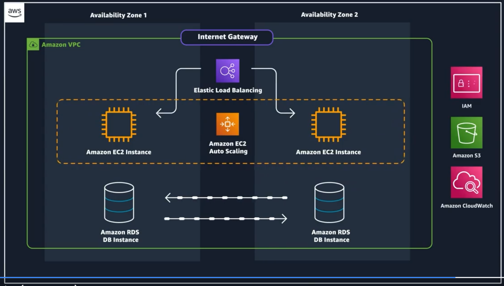
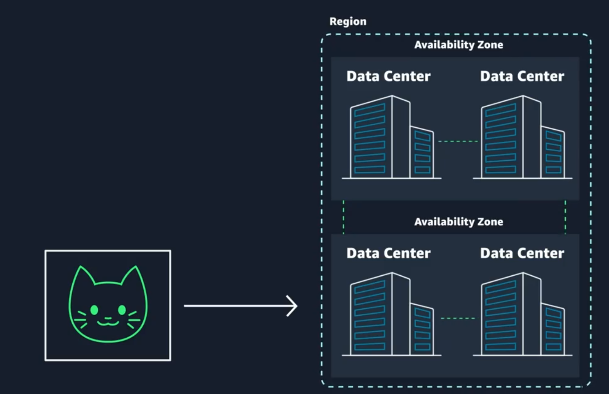
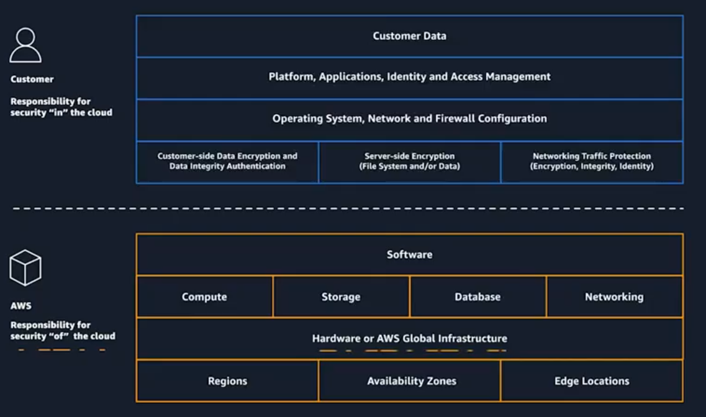
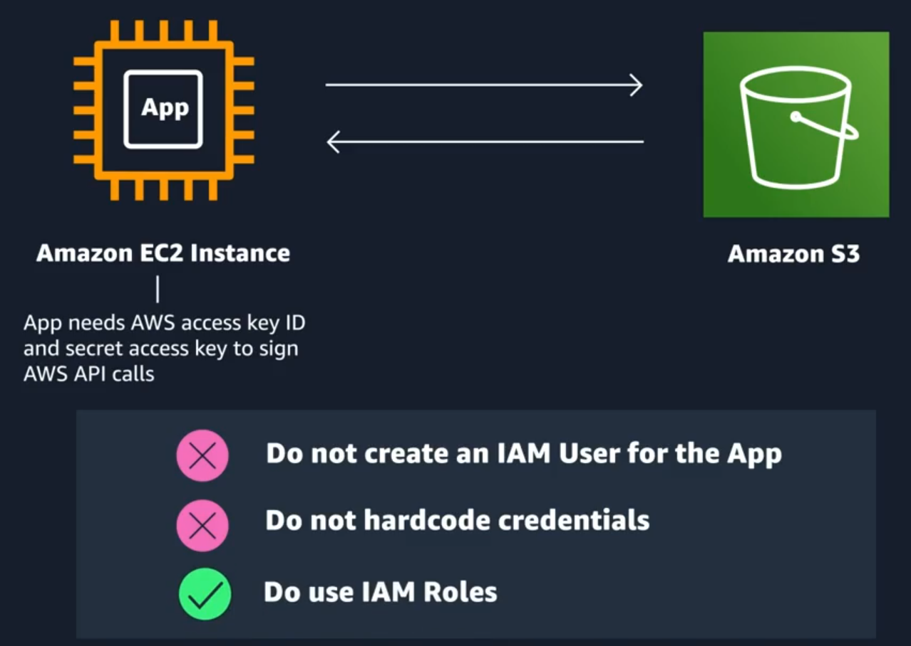
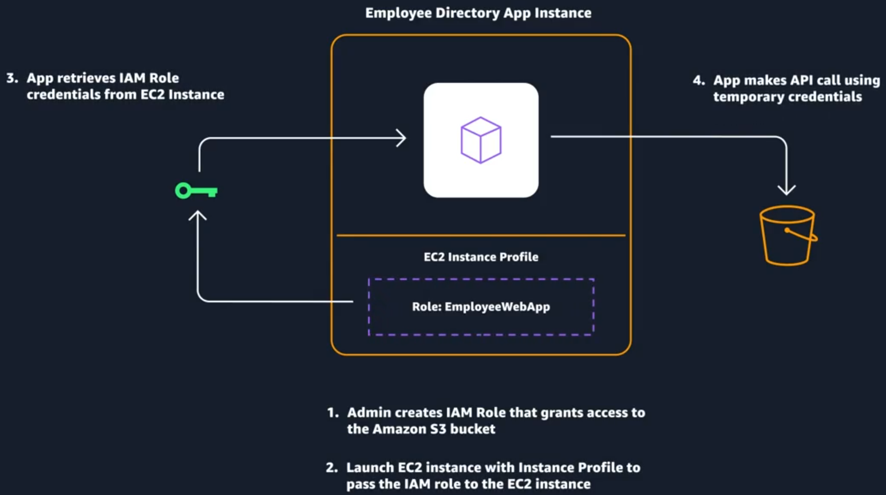

# Week 1: AWS Overview and Security

This application will be built in a private network using Amazon Virtual Private Cloud (VPC). The backend code will be hosted on Amazon Elastic Compute Cloud (EC2), which provides virtual machines on AWS. Let's add these servers to our diagram. Employee data will be stored in a database hosted by Amazon Relational Database Service (RDS), also within this network. I'll add that to the diagram as well. Employee images will be stored using Amazon Simple Storage Service (S3), which offers unlimited storage for any type of file, such as images. These are the basic building blocks of our application.

We will use Amazon CloudWatch for monitoring and ensure our application is scalable and fault-tolerant by adding Amazon Elastic Load Balancing and Amazon EC2 Auto Scaling to the diagram. For security and identity management, we will use Amazon Identity and Access Management (IAM). Let's add that too.

    

## Availability Zones (AZs) and Regions
In AWS, Availability Zones (AZs) and Regions are fundamental concepts for building resilient and scalable applications.

    

* Regions: Definition: A Region is a geographical area that contains multiple, isolated locations known as Availability Zones.
Purpose: Regions allow you to deploy applications closer to your users to reduce latency and meet regulatory requirements.
Example: `us-east-1` (Northern Virginia), `eu-west-1` (Ireland).

* Availability Zones (AZs): Definition: An Availability Zone is a distinct location within a Region, designed to be isolated from failures in other AZs.
Purpose: AZs provide high availability and fault tolerance. By deploying applications across multiple AZs, you can ensure that your application remains available even if one AZ fails.
Example: `us-east-1a`, `us-east-1b`, `us-east-1c` (all within the us-east-1 Region).

### How to choose your region?
1. Restrictions and Compliance
2. Latency
3. Pricing
4. Service availability

## Ways to interact with the AWS API (Application Program Interface)
1. AWS Management Console
2. AWS Command Line Interface (CLI)
3. [AWS Software Development Kits (SDKs)](https://aws.amazon.com/developer/tools/): it works with Python!

## Security and the AWS Shared Responsibility Model

When you begin working with the AWS Cloud, managing security and compliance is a shared responsibility between AWS and you.

    

You’re responsible for security in the cloud. So for our EC2 example, you are responsible for tasks like patching the operating systems of your VMs, encrypting data in transit and at rest, configuring firewalls and controlling who has access to these resources and how much access they have.

### Protect the AWS Root User

Use a MFA to control access to specific AWS service APIs.

The current content focuses on **authentication** and **authorization** in the context of AWS:

- **Authentication**: This is the process of verifying a user's identity, typically through a combination of an email address and password. It answers the question, "Are you who you say you are?" Other methods include token-based authentication and biometric data.

- **Authorization**: Once authenticated, authorization determines what actions a user can perform within AWS, such as reading, editing, or deleting resources. It answers the question, "What actions can you perform?"

- **AWS Root User**: When you create an AWS account, you start with a root user that has complete access to all services and resources. It's crucial to manage the root user's credentials securely and avoid using it for everyday tasks.

- **Multi-Factor Authentication (MFA)**: MFA adds an extra layer of security by requiring two or more authentication methods. This is important to protect accounts from unauthorized access.

- **Best Practices**: Recommendations include using strong passwords, enabling MFA, and managing access keys securely.

## AWS Identity and Access Management

**AWS Identity and Access Management (IAM)**, which is a web service that allows you to manage access to your AWS account and resources. Here are the key points:

* **IAM Overview:**
    * Manages authentication (who can access) and authorization (what they can do) within your AWS account.
    * Allows sharing access without sharing access keys or passwords.
    * Provides granular access control to resources.

* **IAM Features:**
    * Global service, accessible from any AWS region.
    * Integrated with many AWS services.
    * Supports password policies, multi-factor authentication (MFA), and identity federation.
* **IAM Users and Groups:**
    * An IAM user represents a person or service that interacts with AWS.
    * IAM groups are collections of users that inherit permissions, making it easier to manage access.
* **IAM Policies:**
    * Policies are JSON documents that define permissions for users, groups, and roles.
    * Policies can allow or deny specific actions on resources.

## Role Based Access in AWS

    

    

**Identity and Access Management (IAM)** best practices for AWS. Here are the key points:

* **Lock Down the AWS Root User:**
    * Do not share root user credentials.
    * Consider deleting root user access keys.
    * Enable Multi-Factor Authentication (MFA) on the root account.

* **Follow the Principle of Least Privilege:**
    * Grant only necessary permissions for tasks.
    * Start with minimal permissions and add more as needed.

* **Use IAM Appropriately:**
    * IAM secures access to AWS resources by managing users, groups, and roles.
    * It is not for website authentication or protecting operating systems.

* **Use IAM Roles When Possible:**
    * Roles provide temporary credentials, making management easier than user accounts.

* **Consider Using an Identity Provider (IdP):**
    * An IdP can manage employee identities, reducing the need for multiple IAM users.

* **Consider AWS IAM Identity Center:**
    * It allows users to sign in with a single credential for multiple AWS accounts, simplifying user management.

