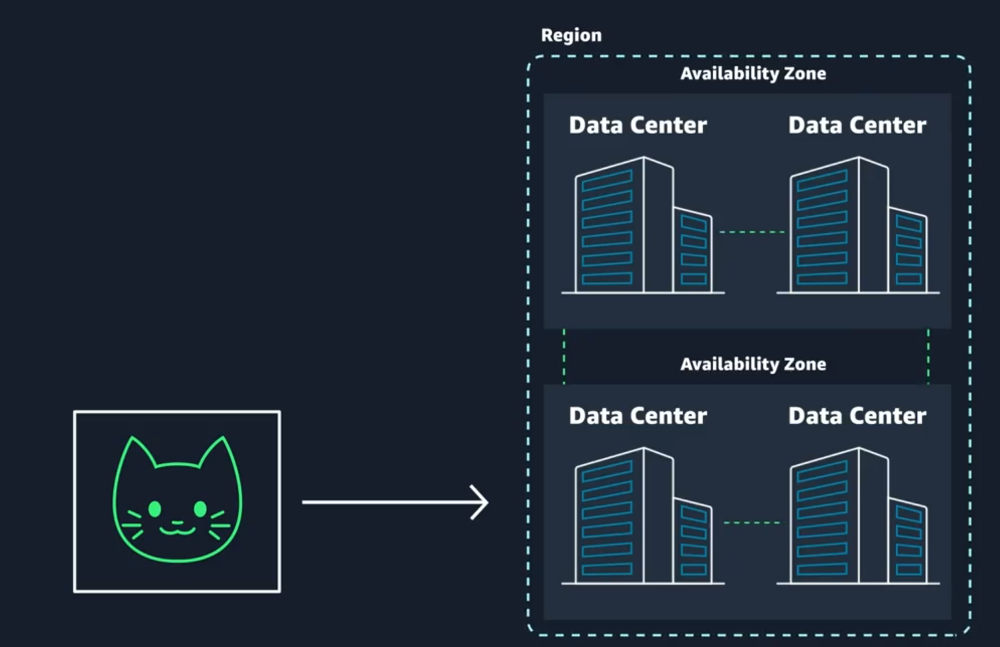

# Week 1: AWS Overview and Security

This application will be built in a private network using Amazon Virtual Private Cloud (VPC). The backend code will be hosted on Amazon Elastic Compute Cloud (EC2), which provides virtual machines on AWS. Let's add these servers to our diagram. Employee data will be stored in a database hosted by Amazon Relational Database Service (RDS), also within this network. I'll add that to the diagram as well. Employee images will be stored using Amazon Simple Storage Service (S3), which offers unlimited storage for any type of file, such as images. These are the basic building blocks of our application.

We will use Amazon CloudWatch for monitoring and ensure our application is scalable and fault-tolerant by adding Amazon Elastic Load Balancing and Amazon EC2 Auto Scaling to the diagram. For security and identity management, we will use Amazon Identity and Access Management (IAM). Let's add that too.

## Availability Zones (AZs) and Regions
In AWS, Availability Zones (AZs) and Regions are fundamental concepts for building resilient and scalable applications.

* Regions: Definition: A Region is a geographical area that contains multiple, isolated locations known as Availability Zones.
Purpose: Regions allow you to deploy applications closer to your users to reduce latency and meet regulatory requirements.
Example: `us-east-1` (Northern Virginia), `eu-west-1` (Ireland).

* Availability Zones (AZs): Definition: An Availability Zone is a distinct location within a Region, designed to be isolated from failures in other AZs.
Purpose: AZs provide high availability and fault tolerance. By deploying applications across multiple AZs, you can ensure that your application remains available even if one AZ fails.
Example: `us-east-1a`, `us-east-1b`, `us-east-1c` (all within the us-east-1 Region).

### How to choose your region?
1. Restrictions and Compliance
2. Latency
3. Pricing
4. Service availability