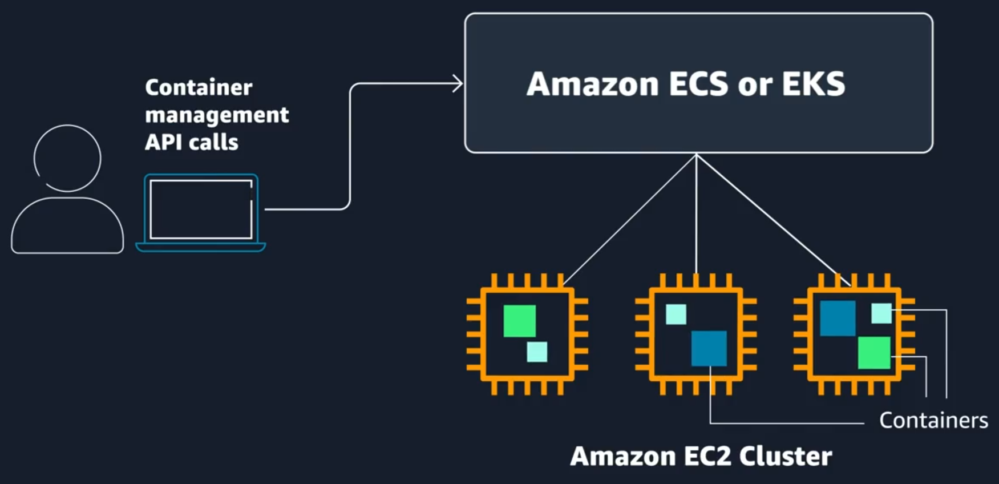
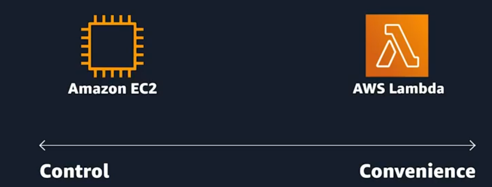
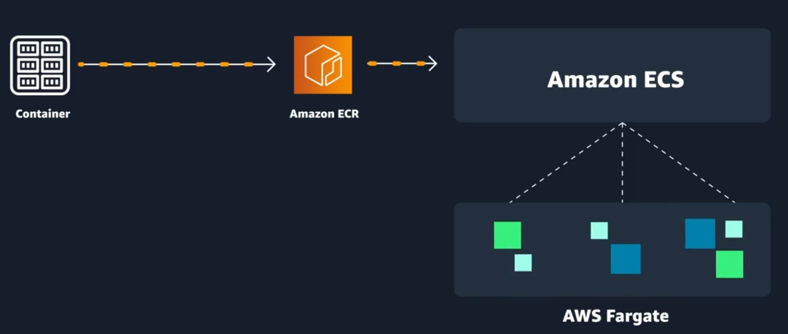
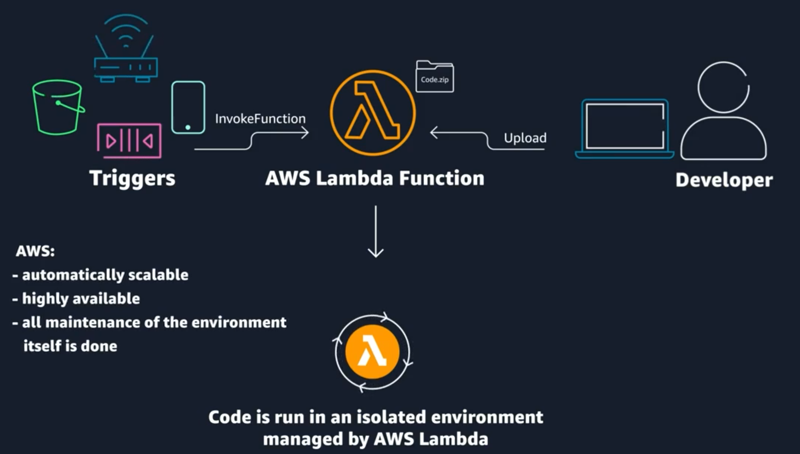
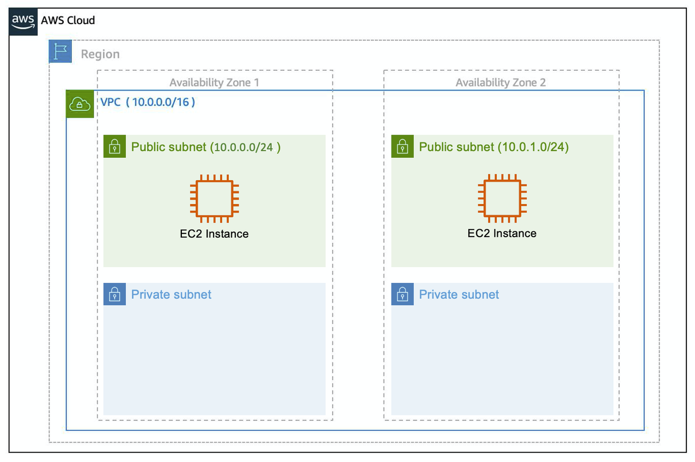
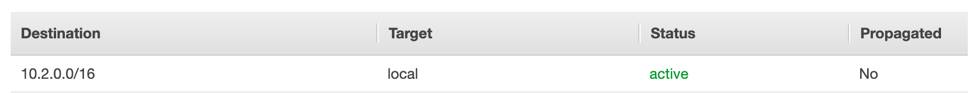
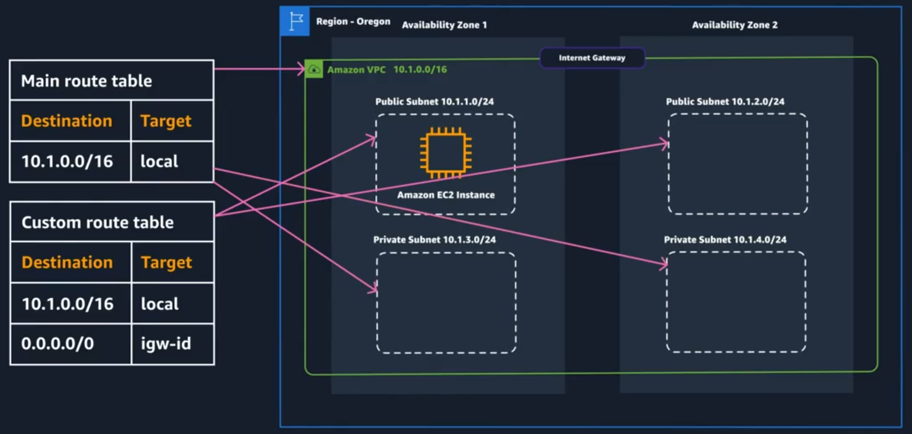
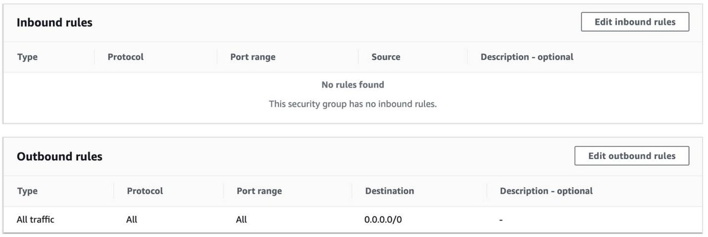
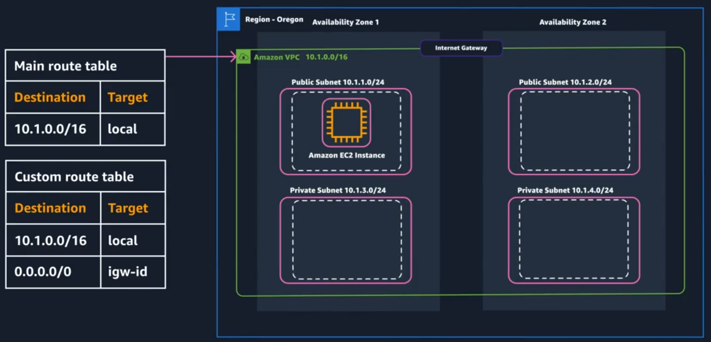
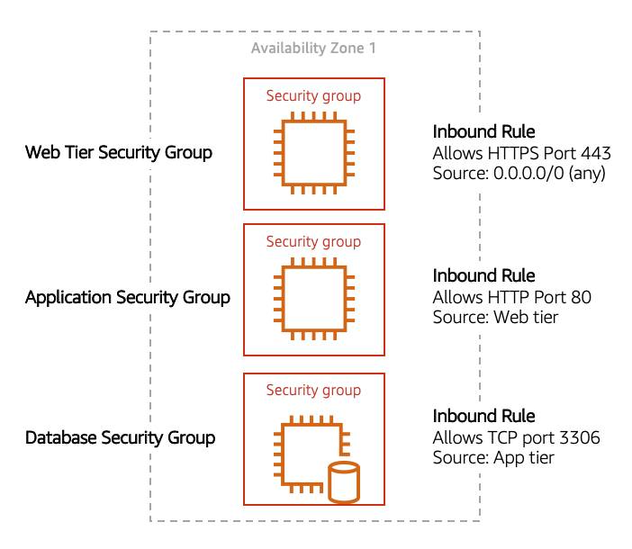

# Compute & Networking

## 1. Compute as a Service on AWS

Servers handle HTTP requests and responses, functioning within the client-server model. A client can be a person or computer that sends requests, while a server is a computer or collection of computers serving websites.

Common HTTP servers include:
- **Windows**: Internet Information Services (IIS)
- **Linux**: Apache HTTP Web Server, Nginx, Apache Tomcat

To run an HTTP server on AWS, you need to select a service that provides compute power. There are three main types of compute options in AWS:
1. **Virtual Machines**: Emulate physical servers. In AWS, these virtual machines are called **Amazon Elastic Compute Cloud** or **Amazon EC2**.
2. **Container Services**
3. **Serverless Computing**

Understanding Amazon EC2 is essential as it serves as the foundation for many AWS compute services.

### Amazon Elastic Compute Cloud (EC2)

Amazon EC2 (Elastic Compute Cloud) is a web service that provides secure and resizable compute capacity in the cloud, allowing users to provision virtual servers known as EC2 instances.

Users can create and manage EC2 instances through various interfaces, including the AWS Management Console and Command Line Interface (CLI).

To launch an EC2 instance, you need to define:

- **Hardware specifications**: CPU, memory, network, and storage.
- **Logical configurations**: Networking location, firewall rules, authentication, and operating system.
- **Amazon Machine Image (AMI)**: This is a pre-configured template that includes the operating system and software needed to launch an EC2 instance. It simplifies the server setup process.

The relationship between AMIs and EC2 instances is similar to a recipe and a cake; the AMI defines the instance, while the EC2 instance is the live version you interact with.

    

AMIs can be reused to create new instances with the same configurations, saving time and reducing errors. AMIs can be found in various categories, including:

- **Quick Start AMIs**
- **AWS Marketplace AMIs**
- **My AMIs**
- **Community AMIs**

### Amazon EC2 Instance Lifecycle

    

#### EC2 Instance Configuration

When creating an EC2 instance, you need to select the operating system, instance type, network, and storage based on your application’s needs.

#### Instance Types

EC2 instances are categorized into families based on their optimization for specific workloads, such as:

- **General Purpose**: Balanced resources for various workloads.
- **Compute Optimized**: High-performance processors for compute-bound applications.
- **Memory Optimized**: Fast performance for memory-intensive applications.
- **Accelerated Computing**: Uses hardware accelerators for specific tasks.
- **Storage Optimized**: Designed for high I/O operations.

#### Availability Zones

EC2 instances reside in Availability Zones within a Virtual Private Cloud (VPC), which helps in architecting for high availability.

#### Instance Lifecycle

Instances transition through states (pending, running, stopped, terminated) and can be rebooted, stopped, or terminated based on your needs.

#### Pricing Options

EC2 offers various pricing models, including:
- **On-Demand Instances**: Pay for what you use without long-term commitments.
- **Reserved Instances**: Commit to a term for a discount.
- **Spot Instances**: Purchase unused capacity at a lower price.

### Container Services on AWS

**Containers:** A container is a standardized unit that packages code and its dependencies, allowing it to run reliably across different environments. This technology has evolved from the 1970s and addresses issues of software reliability during transitions between environments.

**Docker:** A popular container runtime that simplifies the management of containers, making it easy to create, package, deploy, and run them.

**Containers vs. Virtual Machines (VMs):** Containers share the host OS and kernel, making them lightweight and faster to start compared to VMs, which require a full OS copy.

**Orchestration:** Containers on AWS run on EC2 instances, and managing them at scale requires orchestration services like Amazon Elastic Container Service (ECS) and Amazon Elastic Kubernetes Service (EKS).

**Amazon ECS:** An end-to-end service for managing containers, requiring the installation of the Amazon ECS Container Agent on EC2 instances.

**Amazon EKS:** A service for managing Kubernetes workloads in the AWS Cloud, providing advanced orchestration capabilities.

    

### Serverless Services

    

- **Serverless Computing:** Serverless services, like AWS Lambda, abstract the underlying infrastructure, meaning you don't manage the servers directly. This allows you to focus on your application rather than operational tasks like scaling and maintenance.

- **Shared Responsibility Model:** With serverless offerings, AWS takes on more responsibility for the underlying infrastructure, while you remain responsible for aspects like data encryption and access management.

#### AWS Fargate

    

**AWS Fargate**, a serverless compute platform for containers that works with ECS (Elastic Container Service) and EKS (Elastic Kubernetes Service). Here are the key points:

- **Container Orchestration:** ECS or EKS manages the lifecycle of containers.
- **Compute Platform:** Fargate allows you to run containers without managing the underlying infrastructure.
- **No Provisioning Required:** You don't need to worry about provisioning, patching, or managing servers.
- **Cost Structure:** You pay only for the resources (vCPU, memory, storage) consumed by your applications.
- **Use Cases:** Fargate is suitable for microservices, batch processing, machine learning applications, and migrating on-premises applications to the cloud.

#### AWS Lambda

    

- **AWS Lambda** is a serverless compute service that allows you to run code in response to triggers without managing servers.
- You create a **Lambda function** by uploading your code, which runs when a specified trigger occurs (e.g., HTTP requests, file uploads to Amazon S3).
- Lambda functions operate in a managed environment that is **scalable** and **highly available**.
- You can choose the programming language, memory, CPU allocation, and permissions for your function.
- Lambda is designed for short tasks (under 15 minutes) and is not suitable for long-running processes.
- You are billed only for the compute time used, rounded to the nearest millisecond.

An example use case is resizing images uploaded to S3, where a Lambda function is triggered upon a new upload to process the image.

## 2. Networking on AWS

Networking Definition: Networking connects computers globally, allowing them to communicate. An example is the AWS global infrastructure, which uses data centers, Availability Zones, and Regions.

Networking Basics: Similar to sending a letter, networking requires:

- **Payload**: The message itself.
- **Sender's Address**: Information about the sender.
- **Recipient's Address**: Information about the recipient.
- **IP Addresses**: Each computer has a unique IP address, similar to a home address, which is represented in binary format (0s and 1s).

**IPv4 Notation**: IP addresses are typically shown in decimal format, divided into four octets (8 bits each), separated by periods.

**CIDR Notation**: This notation specifies a range of IP addresses. It starts with an IP address followed by a slash and a number indicating how many bits are fixed. For example, 192.168.1.0/24 indicates a range of 256 IP addresses.

**AWS Network Sizing**: In AWS, the smallest IP range is /28 (16 IP addresses) and the largest is /16 (65,536 IP addresses).

### Amazon VPC

- **VPC (Virtual Private Cloud):** An isolated network in the AWS cloud, similar to a traditional data center network. When creating a VPC, you need to choose:
    - A name for your VPC.
    - A Region where the VPC will reside, spanning multiple Availability Zones.
    - An IP range in CIDR notation, determining the network size (up to four /16 IP ranges).

* **Subnets:** Smaller networks within a VPC, used for high availability and connectivity options. When creating a subnet, you need to select:
    - The VPC it belongs to.
    - The Availability Zone.
    - A CIDR block that is a subset of the VPC's CIDR block.
* **High Availability:** It's important to create at least two subnets in different Availability Zones for redundancy.

- **Reserved IPs:** AWS reserves five IP addresses in each subnet for routing and management, impacting network design.

- **Gateways:**
    - Internet Gateway: Connects your VPC to the internet, similar to a modem, and is highly available.
    - Virtual Private Gateway: Connects your VPC to another private network, allowing for an encrypted VPN connection

    

### Amazon VPC

- The VPC has an **internet gateway** and four subnets (two public and two private) across two availability zones.
- **Route tables** are essential for directing internet traffic to the correct subnets. They contain rules (routes) that determine where network traffic is directed. The route table acts like a set of instructions that tells traffic (data) how to get to the right place inside that room

#### The Main Route Table
When a new VPC is created, AWS automatically generates a **main route table** that allows local traffic between subnets.

 
There are two main parts to this route table.

- The destination, which is a range of IP addresses where you want your traffic to go. In the example of sending a letter, you need a destination to route the letter to the appropriate place. The same is true for routing traffic. In this case, the destination is the IP range of our VPC network.

- The target, which is the connection through which to send the traffic. In this case, the traffic is routed through the local VPC network.
VPC_Routing

#### Custom Route Tables

While the main route table controls the routing for your VPC, you may want to be more granular about how you route your traffic for specific subnets. For example, your application may consist of a frontend and a database. You can create separate subnets for these resources and provide different routes for each of them.

If you associate a custom route table with a subnet, the subnet will use it instead of the main route table. By default, each custom route table you create will have the local route already inside it, allowing communication to flow between all resources and subnets inside the VPC. 

- To provide public access to a subnet, a custom route table must be created with a route to the internet gateway.

    

 

### Secure Your Network with Amazon VPC Security

#### Network ACLs (Network Access Control List):

Network ACLs are like the security gates at the entrance of a neighborhood. They control what kind of traffic can come in and go out of your subnet, which is a smaller section of your VPC. By default, these gates are wide open, allowing all traffic. However, you can customize them to only allow specific types of traffic, like HTTPS, which is used for secure web browsing. Just remember, if you let traffic in, you also need to allow the corresponding traffic out, because these gates don’t remember past actions—they treat each request independently.
- Act as a firewall at the subnet level.
- Control what traffic can enter and leave the subnet.
- By default, they allow all traffic but can be customized to restrict specific types (e.g., only allowing HTTPS).
- They are **stateless**, meaning you must set rules for both inbound and outbound traffic.

#### Security Groups:
Security Groups are like the security guards at the front door of a specific house (or EC2 instance). They are more flexible and remember if a connection was initiated from inside or outside. By default, they block all incoming traffic but allow all outgoing traffic. If you want your house (EC2 instance) to accept visitors (like web traffic), you need to tell the guard to let them in by opening specific doors (inbound ports) for HTTP and HTTPS traffic.

    

 

- Function as firewalls at the EC2 instance level.
- Block all inbound traffic by default but allow all outbound traffic.
- You must create inbound rules to allow specific traffic (e.g., HTTP and HTTPS).
- They are **stateful**, meaning they remember the connection and allow responses without needing additional rules.

    

 

*Example:*
This example allows you to define three tiers and isolate each tier with the security group rules you define. In this case, you only allow internet traffic to the web tier over HTTPS, Web Tier to Application Tier over HTTP, and Application tier to Database tier over MySQL. This is different from traditional on-premises environments, in which you isolate groups of resources via VLAN configuration. In AWS, security groups allow you to achieve the same isolation without tying it to your network.

    

 

### Hybrid Connectivity with AWS

When we talk about connecting different parts of an application that are spread out between AWS (Amazon Web Services) and a local data center, we are discussing a **hybrid model**. Imagine you have a restaurant (your local data center) and a delivery service (AWS). Some of your ingredients are stored in the restaurant, while others are kept in a warehouse (AWS). You need a reliable way to get those ingredients from the warehouse to your restaurant.

To connect your restaurant to the warehouse, you can use a **VPN (Virtual Private Network)**. Think of it as a secure delivery truck that transports your ingredients safely. There are two types of VPNs:
- **Site-to-Site VPN:** This is like a big truck that connects your restaurant directly to the warehouse, allowing for a steady flow of ingredients.
- **Client VPN:** This is more like a small delivery van that allows your staff to access the warehouse from their homes or laptops when they need to pick up supplies.

Additionally, there's **AWS Direct Connect**, which is like having a private road that goes straight from your restaurant to the warehouse. This road is faster and more reliable than regular streets (the public internet), ensuring that your ingredients arrive without delays or traffic jams.

### Common network troubleshooting steps for Amazon VPC

List of configurations you should check if you ever have a public EC2 instance with a web application that is not loading as expected.

1. Internet Gateway: Ensure an Internet Gateway is attached to your VPC.
2. Route Tables: Verify the route table has a route to 0.0.0.0/0 pointing to the Internet Gateway.
3. Security Groups: Check inbound rules for HTTP (port 80) and/or HTTPS (port 443) traffic. Also, verify that outbound rules allow traffic to leave the instance.
4. Network Access Control Lists (NACLs): Ensure they allow inbound and outbound traffic for HTTP and HTTPS.
5. Public IP Address: Confirm the EC2 instance has a public IP assigned.
6. HTTP vs HTTPS: Make sure the application is accessed via the correct protocol.
7. User Data Script: Verify that any user data script has run successfully. Check the instance logs (/var/log/cloud-init.log or /var/log/cloud-init-output.log) for any errors that may have occurred during the execution of the user data script.
8. Permissions: Verify the permissions and roles attached to your EC2 instance. Ensure the instance has the necessary IAM roles and policies to access any required AWS services, such as S3, DynamoDB, or RDS.
9. Personal Network Permissions: Ensure your network does not block access to the public IP.
10. Application: Ensure that your application code is correctly deployed and running. Check the application's logs to diagnose any runtime errors. Also, make sure the web server (e.g., Apache, Nginx) is installed and running.
