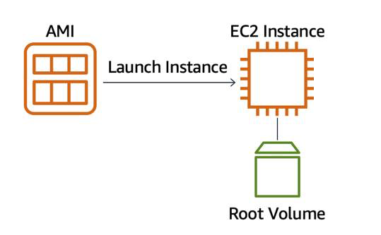
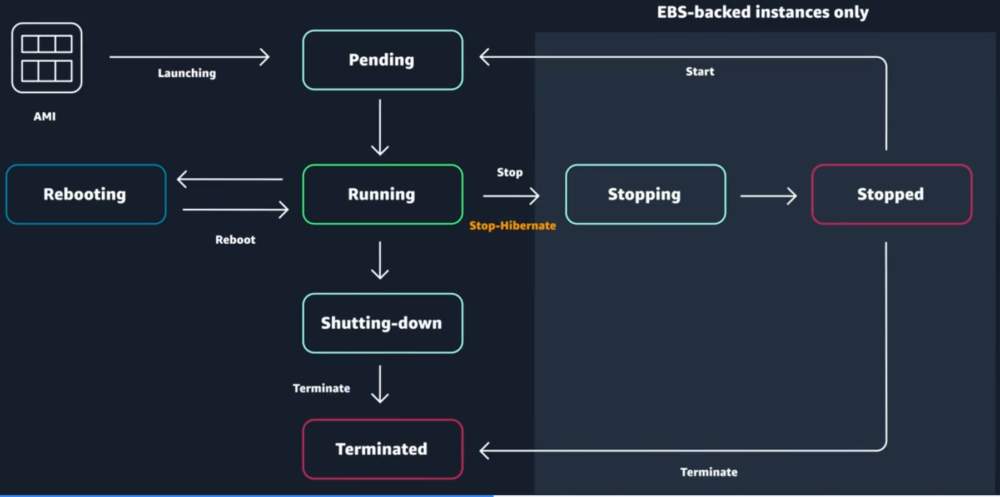

# Compute & Networking

## Compute as a Service on AWS

Servers handle HTTP requests and responses, functioning within the client-server model. A client can be a person or computer that sends requests, while a server is a computer or collection of computers serving websites.

Common HTTP servers include:
- **Windows**: Internet Information Services (IIS)
- **Linux**: Apache HTTP Web Server, Nginx, Apache Tomcat

To run an HTTP server on AWS, you need to select a service that provides compute power. There are three main types of compute options in AWS:
1. **Virtual Machines**: Emulate physical servers. In AWS, these virtual machines are called **Amazon Elastic Compute Cloud** or **Amazon EC2**.
2. **Container Services**
3. **Serverless Computing**

Understanding Amazon EC2 is essential as it serves as the foundation for many AWS compute services.

## Amazon Elastic Compute Cloud (EC2)

Amazon EC2 (Elastic Compute Cloud) is a web service that provides secure and resizable compute capacity in the cloud, allowing users to provision virtual servers known as EC2 instances.

Users can create and manage EC2 instances through various interfaces, including the AWS Management Console and Command Line Interface (CLI).

To launch an EC2 instance, you need to define:

- **Hardware specifications**: CPU, memory, network, and storage.
- **Logical configurations**: Networking location, firewall rules, authentication, and operating system.
- **Amazon Machine Image (AMI)**: This is a pre-configured template that includes the operating system and software needed to launch an EC2 instance. It simplifies the server setup process.

The relationship between AMIs and EC2 instances is similar to a recipe and a cake; the AMI defines the instance, while the EC2 instance is the live version you interact with.

    

AMIs can be reused to create new instances with the same configurations, saving time and reducing errors. AMIs can be found in various categories, including:

- **Quick Start AMIs**
- **AWS Marketplace AMIs**
- **My AMIs**
- **Community AMIs**
 

 ## Amazon EC2 Instance Lifecycle

 

    

