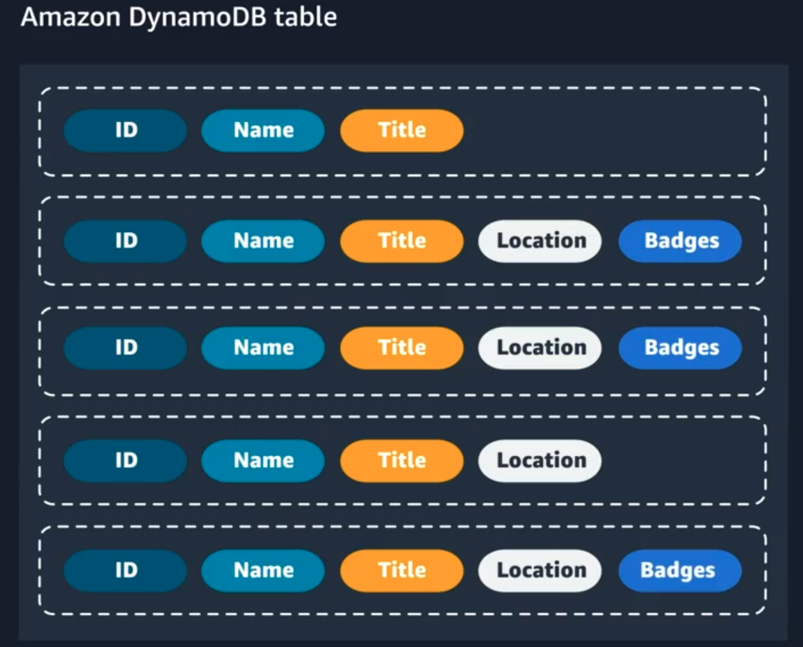

# Storage & Databases on AWS
## 1. Storage

### Storage Types on AWS

- **File Storage:**
    - Organizes files in a hierarchical structure (like folders).
    - Ideal for centralized access and sharing among multiple computers.
    - Common use cases include large content repositories and development environments.
- **Block Storage:**
    - Splits files into fixed-size chunks called blocks, each with its own address.
    - Allows for efficient retrieval and modification of data.
    - Optimized for high-performance workloads, such as databases.
- **Object Storage:**
    - Stores data as objects in a flat structure, each with a unique identifier.
    - Easier to scale and suitable for large datasets and unstructured files.
    - Changing data requires updating the entire object.

**Block Storage vs. Object Storage:**
    - **Block Storage:** Files are split into fixed-size chunks (blocks). This allows for easy updates, as you can change just the block that needs modification.
    - **Object Storage:** Each file is treated as a single unit. To change a file, the entire file must be updated, which can be less efficient for frequent changes.

- Usage Recommendations:
    - Object Storage is suitable for static data (like photos) that is accessed often but modified rarely.
    - Block Storage is better for frequently updated data or high transaction rates (like application files).

### Amazon EC2 Instance Storage and Amazon Elastic Block Store

- **Block Storage Types:**
    - Instance Store:
        - Directly attached storage to the physical server.
        - Fast access but data is lost if the instance is stopped or terminated.
    - Amazon Elastic Block Store (EBS):
        - Network-attached storage that persists even if the EC2 instance is stopped or terminated.
        - Allows multiple EBS volumes to be attached to a single instance.
        - Supports EBS Multi-Attach for attaching to multiple instances simultaneously.
- **Data Backup:**
    - EBS volumes can be backed up using snapshots, which are incremental backups stored redundantly.

**Amazon Elastic Block Store (EBS)**
- Definition: A block-level storage device that can be attached to an EC2 instance.

- Characteristics:
    - Persistent Storage: Data remains even if the instance is stopped or terminated.
    Volume Types: Includes SSDs (for high performance) and HDDs (for cost-effective storage).
    - Scaling: Volumes can be resized or additional volumes can be attached to an instance.

- EBS Use Cases
    - Operating systems (boot volumes)
    - Databases (transactional reads/writes)
    - Enterprise applications (business-critical applications)
    - Databases (SQL )

- Benefits of EBS
    - High Availability: Automatically replicated within its Availability Zone.
    - Data Encryption: Supports encryption for security.
    - Flexibility: Allows on-the-fly changes to volume type and size.
    - Backups: EBS snapshots provide incremental backups stored in Amazon S3.

 ### Object Storage with Amazon S3

**Amazon S3 Overview:** Amazon S3 is an object storage service that allows you to store and retrieve data from anywhere on the web. It uses a flat structure to store data as objects, which consist of files and metadata.

**Buckets:** Objects are stored in containers called buckets. You must create a bucket before uploading any objects, specifying a unique bucket name and an AWS Region.

    

**Durability and Availability:** Amazon S3 provides high durability (99.999999999%) and availability (99.99%) by redundantly storing objects across multiple devices and Availability Zones.

**Access Management:** S3 resources are private by default. You can manage access using IAM policies and S3 bucket policies to define permissions for users and resources.

**Encryption:** S3 supports encryption for data at rest and in transit, using server-side and client-side encryption methods.

**Versioning:** S3 allows you to enable versioning to keep multiple versions of an object, preventing accidental overwrites and deletions.

**Storage Classes:** There are several storage classes in S3, including Standard, Intelligent-Tiering, and Glacier, allowing you to optimize costs based on access patterns.

1. Amazon S3 Standard: This is considered general purpose storage for cloud applications, dynamic websites, content distribution, mobile and gaming applications, and big data analytics.

2. Amazon S3 Intelligent-Tiering: This tier is useful if your data has unknown or changing access patterns. S3 Intelligent-Tiering stores objects in two tiers, a frequent access tier and an infrequent access tier. Amazon S3 monitors access patterns of your data, and automatically moves your data to the most cost-effective storage tier based on frequency of access.

3. Amazon S3 Standard-Infrequent Access (S3 Standard-IA): S3 Standard-IA is for data that is accessed less frequently, but requires rapid access when needed. S3 Standard-IA offers the high durability, high throughput, and low latency of S3 Standard, with a low per-GB storage price and per-GB retrieval fee. This storage tier is ideal if you want to store long-term backups, disaster recovery files, and so on.

4. Amazon S3 One Zone-Infrequent Access (S3 One Zone-IA): Unlike other S3 storage classes which store data in a minimum of three Availability Zones (AZs), S3 One Zone-IA stores data in a single AZ and costs 20% less than S3 Standard-IA. S3 One Zone-IA is ideal for customers who want a lower-cost option for infrequently accessed data but do not require the availability and resilience of S3 Standard or S3 Standard-IA. It’s a good choice for storing secondary backup copies of on-premises data or easily re-creatable data.

5. Amazon S3 Glacier Instant Retrieval: Amazon S3 Glacier Instant Retrieval is an archive storage class that delivers the lowest-cost storage for long-lived data that is rarely accessed and requires retrieval in milliseconds.

6. Amazon S3 Glacier Flexible Retrieval:S3 Glacier Flexible Retrieval delivers low-cost storage, up to 10% lower cost (than S3 Glacier Instant Retrieval), for archive data that is accessed 1—2 times per year and is retrieved asynchronously.

7. Amazon S3 Glacier Deep Archive: S3 Glacier Deep Archive is Amazon S3’s lowest-cost storage class and supports long-term retention and digital preservation for data that may be accessed once or twice in a year. It is designed for customers—particularly those in highly regulated industries, such as the Financial Services, Healthcare, and Public Sectors—that retain data sets for 7 to 10 years or longer to meet regulatory compliance requirements.

8. Amazon S3 Outposts:Amazon S3 on Outposts delivers object storage to your on-premises AWS Outposts environment.

**Lifecycle Management:** You can automate the transition of objects between storage classes and set expiration policies to manage data efficiently. For example, you might choose to transition objects to S3 Standard-IA storage class 30 days after you created them, or archive objects to the S3 Glacier storage class one year after creating them.

### Choose the Right Storage Service

* **Amazon EC2 Instance Store:**
    * Think of it as a temporary hard drive that is built into a computer (EC2 instance).
    * It's great for storing things that change a lot, like a workspace for a project.
    * However, if the computer shuts down, you lose everything on this hard drive.

* **Amazon EBS (Elastic Block Store):**
    * This is like a regular hard drive that you can attach to your computer.
    * It keeps your data safe even if the computer is turned off or crashes.
    * You can choose between two types:
    * SSD: Fast and good for things like databases.
    * HDD: Slower but better for large amounts of data that don’t change often.

* **Amazon S3 (Simple Storage Service):**
    * Imagine a big online storage locker where you can keep files like photos, videos, or backups.
    * You only pay for the space you use, and it’s very reliable.
    * It’s perfect for things that don’t change often, like storing a website or archives.

* **Amazon EFS (Elastic File System) and Amazon FSx:**
    * These are like shared folders that multiple computers can access at the same time.
    * **EFS:** Works like a network drive for Linux systems.
    * **FSx:** Works like a network drive for Windows systems.
    * They are useful when you need to share files between different computers.

## 2. Databases on AWS

### Amazon Relational Database Service (RDS)
 
**Amazon RDS Overview:** Amazon RDS (Relational Database Service) allows you to create and manage relational databases in the cloud, reducing the operational burden of traditional database management. It supports various database engines, including commercial (Oracle, SQL Server), open source (MySQL, PostgreSQL, MariaDB), and cloud-native (Amazon Aurora).

**DB Instances:** A DB instance is the compute portion that runs the database engine. It can contain multiple databases and uses Amazon Elastic Block Store (EBS) for storage. There are three instance families: Standard, Memory Optimized, and Burstable Performance.

**VPC and Security:** When creating a DB instance, you select a Virtual Private Cloud (VPC) and configure subnets for security. Network access control lists (ACLs) and security groups help manage traffic to the database.

**Backup Options:** Amazon RDS offers automatic backups (enabled by default) and manual snapshots. Automated backups allow point-in-time recovery, while manual snapshots can be retained longer than 35 days.

**Multi-AZ Configuration:** Enabling Multi-AZ creates a redundant copy of the database in another Availability Zone (AZ) for improved availability and automatic failover in case of issues.

    

### Purpose Built Databases on AWS

* **No one-size-fits-all database:** Different databases serve different purposes, and it's essential to select one that fits your use case.
Amazon RDS: Traditionally used for relational databases, but may not be suitable for simple applications like an employee directory.

    

* **Amazon DynamoDB:** A NoSQL database ideal for key-value pairs or document data, offering millisecond latency and usage-based pricing, making it a better fit for simple lookup tables.
* Other AWS database offerings:
    * **Amazon DocumentDB** for content management systems.
    * **Amazon Neptune** for social networks and recommendation engines.
    * **Amazon QLDB** for immutable ledgers, suitable for industries requiring audit trails.

The emphasis is on using the best tool for the job to simplify database management and focus on application value.

### Amazon DynamoDB

**Amazon DynamoDB** is a fully managed NoSQL database service that provides fast and predictable performance with seamless scalability. DynamoDB lets you offload the administrative burdens of operating and scaling a distributed database so that you don't have to worry about hardware provisioning, setup and configuration, replication, software patching, or cluster scaling

* **Administrative Ease:** Offloads tasks like hardware provisioning, setup, replication, and scaling.
* **Data Storage:** Allows creation of tables to store and retrieve any amount of data, with the ability to scale throughput capacity without downtime.
* Core Components:
    * **Tables:** Collections of items (e.g., a "People" table for contact information).
    * **Items:** Groups of attributes uniquely identifiable within a table.
    * **Attributes:** Fundamental data elements that make up items (e.g., PersonID, LastName).
    

    
    

* **Security:** Offers encryption at rest for sensitive data protection.

    

### AWS Database Services

AWS has a variety of different database options for different use cases. Use the table below to get a quick look at the AWS database portfolio.

    

