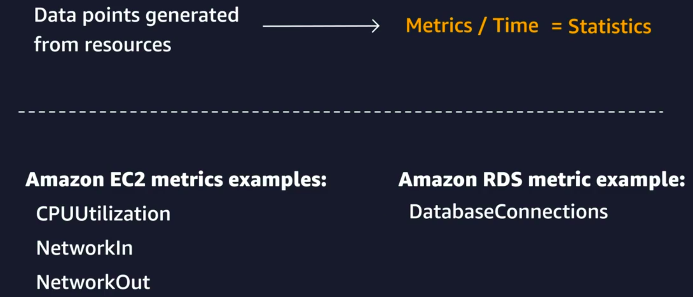
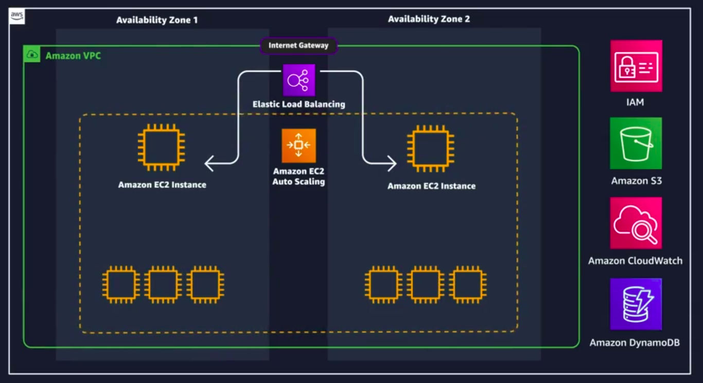
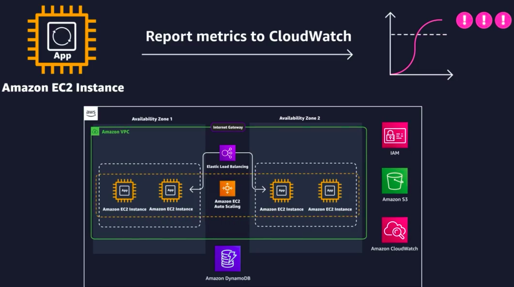
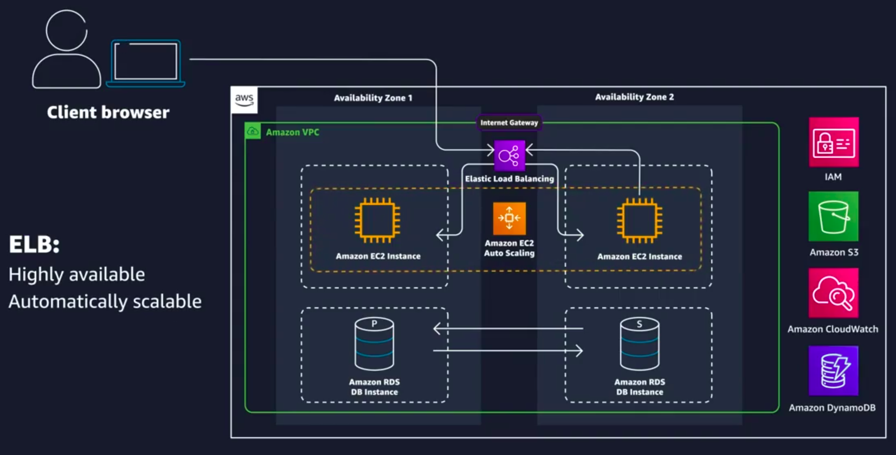
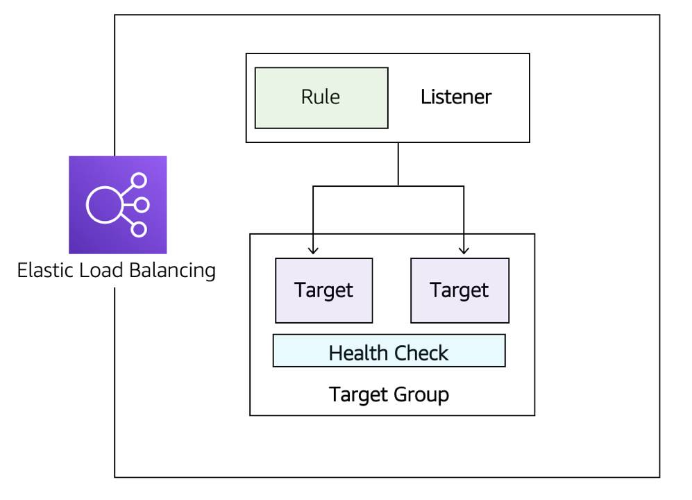

# Monitoring & Optimization

## 1. Monitoring on AWS

Monitoring is like having a security camera for your application. Just as a camera helps you see what's happening in a store, monitoring tools help you keep an eye on how your application is performing. For example, if users are experiencing slow page loads, you want to know about it before they do. This way, you can fix the problem quickly and keep your users happy. Monitoring collects important information, like how much memory your application is using or how many people are connected to your database, so you can spot issues before they become big problems.

Imagine you're a chef in a busy restaurant. You want to know if the oven is too hot or if the ingredients are running low before the customers complain. Monitoring your application works the same way; it helps you check the "temperature" of your system and make adjustments as needed.

    

**Monitoring Definition:**
The process of collecting, analyzing, and using data to assess the operational health and usage of IT resources.

**Importance of Monitoring:**
* Provides real-time insights into system performance.
* Helps identify operational issues before they affect users.
* Improves resource performance and reliability.
* Recognizes security threats by establishing a baseline of normal activity.
* Supports data-driven business decisions.
* Enables cost optimization by identifying underutilized resources.

**Metrics:** Data points collected from resources (e.g., CPU utilization, network performance) that help evaluate system health.

**Types of Metrics:** Different AWS resources generate different metrics (e.g., EC2 instances vs. S3 buckets).

**Amazon CloudWatch:** A service that centralizes monitoring data, allowing users to visualize metrics, set alarms, and automate responses to performance changes.

### Amazon CloudWatch

**Overview:** CloudWatch is a managed service that allows you to monitor AWS resources without managing infrastructure. It centralizes metrics from various AWS services.

**Metrics:** Different AWS resources send metrics to CloudWatch automatically, providing basic monitoring for free. Detailed monitoring is available for a fee, allowing metrics to be posted every minute.

**Custom Metrics:** You can create custom metrics for application-specific data, such as page views or error rates, using the PutMetricData API.

**Dashboards:** CloudWatch dashboards allow you to visualize metrics through customizable widgets. You can aggregate data from different regions and control access through IAM policies.

**Logs:** CloudWatch Logs stores and analyzes log files from various sources. You can query logs and set up metric filters to convert log data into metrics.

**Alarms:** You can create alarms to trigger actions based on metric thresholds. Alarms can notify you or initiate automated responses to issues.

## 2. Optimizing Solutions on AWS

### Optimizing Solutions on AWS

    

* **Current Setup:** You have an EC2 instance hosting an application, with DynamoDB for the database and S3 for storage.
* **Availability Issues:** If the single EC2 instance goes down, employees cannot access the application. To solve this, you need redundancy by adding another instance in a different availability zone (AZ).
* **Scaling Options:** You can scale vertically (increasing the size of instances) or horizontally (adding more instances). Horizontal scaling is preferred as it allows for more flexibility.
* **Automation with EC2 Auto Scaling:** This service automates the process of adding and removing instances based on defined conditions, maintaining the health of your fleet.
* **Load Balancing:** With multiple instances, a load balancer is used to distribute requests, eliminating the need to manage individual public IPs.

### Optimizing Solutions on AWS

* Availability Percentages and Downtime:
    * 90% (one nine): 36.53 days downtime
    * 99% (two nines): 3.65 days
    * 99.9% (three nines): 8.77 hours
    * 99.95% (three and a half nines): 4.38 hours
    * 99.99% (four nines): 52.60 minutes
    * 99.999% (five nines): 5.26 minutes
* Increasing Availability:
    * Requires redundancy, which involves more infrastructure (servers, data centers).
    * Balancing cost and customer needs is essential.
* Single Point of Failure:
    * A single EC2 instance can lead to downtime; adding another instance can mitigate this risk.
* Using Multiple Availability Zones:
    * Deploying instances in different zones helps address hardware and software issues.
* Challenges:
    * Replication: Automating the replication of configurations and applications.
    * Client Redirection: Using DNS or load balancers to manage server requests.
    * Types of High Availability:
    * Active-Passive: Only one instance is active at a time.
    * Active-Active: Both instances are active, allowing for better scalability.

### Amazon EC2 Auto Scaling

    

* Demand Management: As application traffic increases, the need for more EC2 instances arises. Auto Scaling allows for automatic provisioning of additional instances based on demand.
* CloudWatch Integration: Instances report their CPU load to CloudWatch, which triggers alarms when thresholds are exceeded, prompting Auto Scaling to launch more instances.
* Launch Template Creation: A launch template is created to define the configuration for new instances, ensuring they are identical to existing ones.
* Auto-Scaling Group Setup: An auto-scaling group is established to manage the number of instances, specifying minimum, maximum, and desired capacities.
* Scaling Policies: Policies are set to adjust capacity based on metrics like CPU utilization, allowing for dynamic scaling in response to demand.
* Stress Testing: A stress test simulates load on the application, demonstrating how the system scales up and down based on CPU utilization.

### Route Traffic with Amazon Elastic Load Balancing (ELB)

    

* Load Balancing: The process of distributing tasks across resources, specifically EC2 instances in this context. It directs incoming requests to backend servers using algorithms, with round-robin being the most common.
* Elastic Load Balancing (ELB): AWS service that manages load balancing without requiring user management. It can distribute traffic across EC2 instances, containers, IP addresses, and AWS Lambda functions. ELB is highly available and automatically scales with incoming traffic.
* Health Checks: Essential for ensuring that the application and its dependencies (like databases) are functioning correctly. A monitoring page can be created to validate these elements.
* ELB Components:
    * Listeners: Define how clients connect to the load balancer.
    * Target Groups: Specify the backend servers for traffic distribution.
    * Rules: Determine how traffic is routed based on conditions.
    

    
    

* Application Load Balancer (ALB): Routes traffic based on HTTP request data, supports TLS offloading, user authentication, and sticky sessions.
* Network Load Balancer (NLB): Supports TCP, UDP, and TLS protocols, operates at the connection layer, and preserves the source IP address.
* Choosing ELB Types: Depends on the required features for the application, such as protocol support and routing capabilities.

### Amazon EC2 Auto Scaling

- **Vertical Scaling (Active-Passive):**
    - Involves increasing the size of a single server.
    - Requires stopping the instance, changing its size/type, and restarting it.
    - Limited by the maximum size of the server.
- **Horizontal Scaling (Active-Active):**
    - Involves adding more servers to handle increased requests.
    - Requires the application to be stateless, allowing for easy scaling without changes.
    - Managed by Amazon EC2 Auto Scaling, which adjusts capacity based on demand.
- **EC2 Auto Scaling Components:**
    - Launch Template: Defines parameters for creating EC2 instances.
    - Auto Scaling Group (ASG): Specifies where resources are deployed and manages instance capacity.
    - Scaling Policies: Automate the addition or removal of instances based on metrics.
- **Health Checks:** Ensure that only healthy instances receive traffic, enhancing reliability.